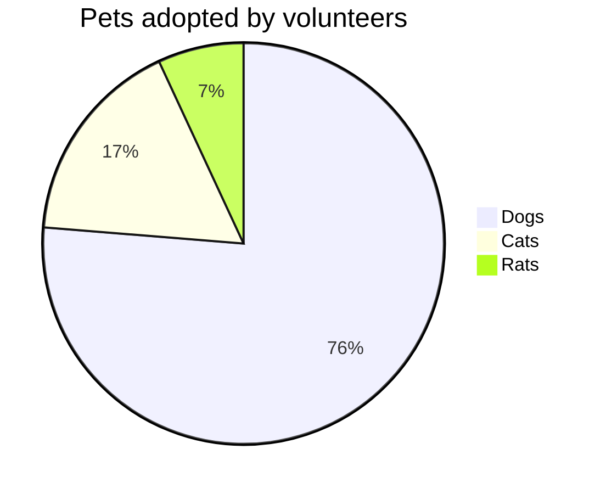

To use LaTeX in Jekill, follow [Jekyll Spaceship][https://github.com/jeffreytse/jekyll-spaceship]

<h4> MathJax </h4>
`$ a * b = c ^ b $`  
$ a * b = c ^ b $
 
`$ 2^{\frac{n-1}{3}} $` 
$ 2^{\frac{n-1}{3}} $
 
`$ \int\_a^b f(x)\,dx. $`
$ \int\_a^b f(x)\,dx. $

<h4>Mermaid</h4>
Mermaid is a Javascript based diagramming and charting tool. It generates diagrams flowcharts and more, using markdown-inspired text for ease and speed.

<h4>Media Usage</h4>

<h4> Table </h4>
|              Stage | Direct Products | ATP Yields |
| -----------------: | --------------: | ---------: |
|         Glycolysis |          2 ATP              ||
| ^^                 |          2 NADH |   3--5 ATP |
| Pyruvaye oxidation |          2 NADH |      5 ATP |
|  Citric acid cycle |          2 ATP              ||
| ^^                 |          6 NADH |     15 ATP |
| ^^                 |          2 FADH |      3 ATP |
|                               30--32 ATP        |||

 
| :    Easy Multiline   : |||
| :----- | :----- | :------ |
| Apple  | Banana | Orange  \
| Apple  | Banana | Orange  \
| Apple  | Banana | Orange
| Apple  | Banana | Orange  \
| Apple  | Banana | Orange  |
| Apple  | Banana | Orange  |

 
|--|--|--|--|--|--|--|--|
|♜| |♝|♛|♚|♝|♞|♜|
| |♟|♟|♟| |♟|♟|♟|
|♟| |♞| | | | | |
| |♗| | |♟| | | |
| | | | |♙| | | |
| | | | | |♘| | |
|♙|♙|♙|♙| |♙|♙|♙|
|♖|♘|♗|♕|♔| | |♖|

 

| :        Fruits \|\| Food       : |||
| :--------- | :-------- | :--------  |
| Apple      | : Apple : | Apple      \
| Banana     |   Banana  | Banana     \
| Orange     |   Orange  | Orange     |
| :   Rowspan is 4    : || How's it?  |
|^^    A. Peach         ||   1. Fine :|
|^^    B. Orange        ||^^ 2. Bad   |
|^^    C. Banana        ||  It's OK!  |

 
| :                   MathJax \|\| Image                 : |||
| :------------ | :-------- | :----------------------------- |
| Apple         | : Apple : | Apple                          \
| Banana        | Banana    | Banana                         \
| Orange        | Orange    | Orange                         |
| :     Rowspan is 4     : || :        How's it?           : |
| ^^     A. Peach          ||    1. ![example][cell-image]   |
| ^^     B. Orange         || ^^ 2. $I = \int \rho R^{2} dV$ |
| ^^     C. Banana         || **It's OK!**                   |

 
{:color-style: style="background: black;"}
{:color-style: style="color: white;"}
{:text-style: style="font-weight: 800; text-decoration: underline;"}

|:             Here's an Inline Attribute Lists example                :||||
| ------- | ------------------ | -------------------- | ------------------ |
|:       :|:  
 &lt; Normal HTML Block > 
 :|||
| ^^      |   Red    {: .cls style="background: orange" }                |||
| ^^ IALs |   Green  {: #id style="background: green; color: white" }    |||
| ^^      |   Blue   {: style="background: blue; color: white" }         |||
| ^^      |   Black  {: color-style text-style }                         |||